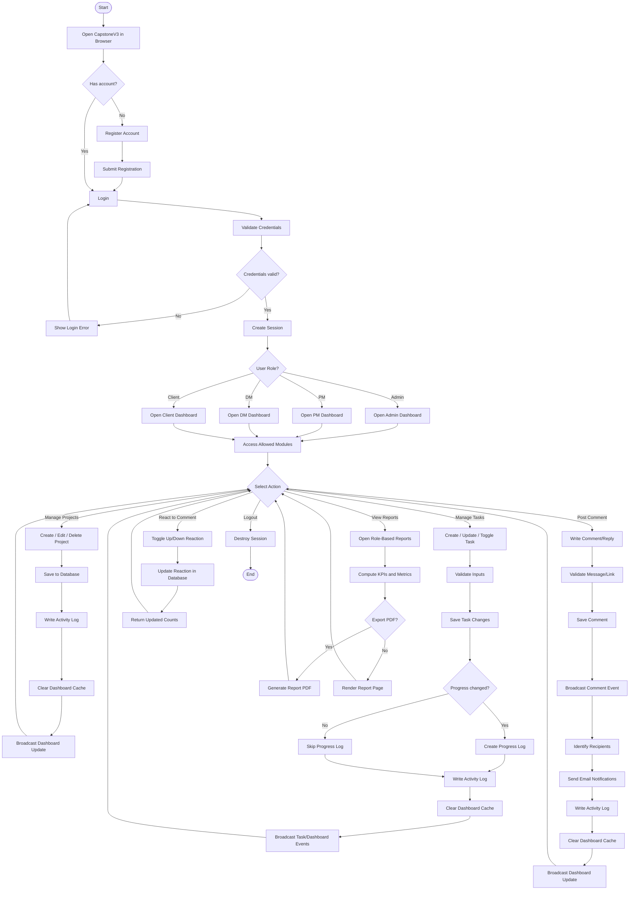

# CapstoneV3 UML Activity Diagram

This activity diagram models the main operational flow of CapstoneV3 from authentication to project/task collaboration and reporting.

## Notes

- Authentication and role checks gate access to protected modules.
- Core operations write audit data using activity/progress logs.
- Cache invalidation and broadcast events keep dashboards updated.
- Comment workflows include notification dispatch to relevant users.
