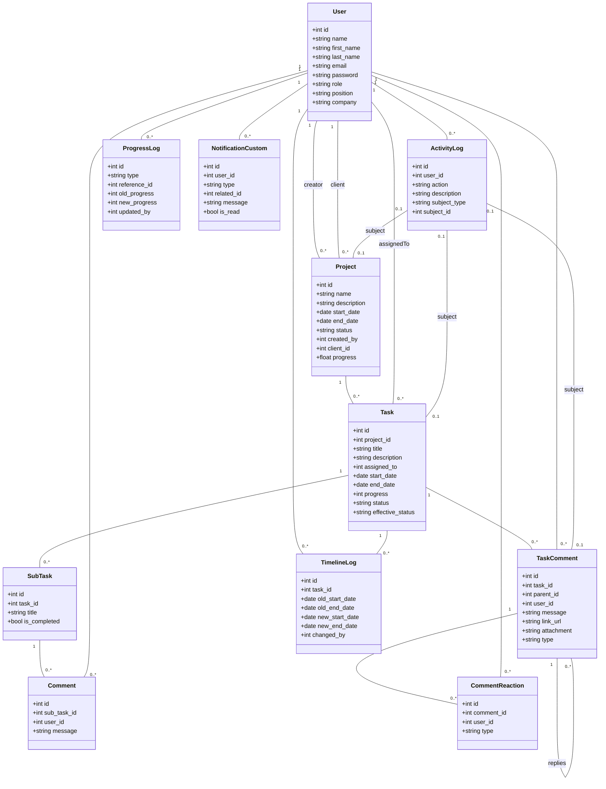

# CapstoneV3 UML Class Diagram

```mermaid
classDiagram
    class User {
        +int id
        +string name
        +string first_name
        +string last_name
        +string email
        +string password
        +string role
        +string position
        +string company
    }

    class Project {
        +int id
        +string name
        +string description
        +date start_date
        +date end_date
        +string status
        +int created_by
        +int client_id
        +float progress
    }

    class Task {
        +int id
        +int project_id
        +string title
        +string description
        +int assigned_to
        +date start_date
        +date end_date
        +int progress
        +string status
        +string effective_status
    }

    class SubTask {
        +int id
        +int task_id
        +string title
        +bool is_completed
    }

    class TaskComment {
        +int id
        +int task_id
        +int parent_id
        +int user_id
        +string message
        +string link_url
        +string attachment
        +string type
    }

    class Comment {
        +int id
        +int sub_task_id
        +int user_id
        +string message
    }

    class CommentReaction {
        +int id
        +int comment_id
        +int user_id
        +string type
    }

    class ActivityLog {
        +int id
        +int user_id
        +string action
        +string description
        +string subject_type
        +int subject_id
    }

    class TimelineLog {
        +int id
        +int task_id
        +date old_start_date
        +date old_end_date
        +date new_start_date
        +date new_end_date
        +int changed_by
    }

    class ProgressLog {
        +int id
        +string type
        +int reference_id
        +int old_progress
        +int new_progress
        +int updated_by
    }

    class NotificationCustom {
        +int id
        +int user_id
        +string type
        +int related_id
        +string message
        +bool is_read
    }

    User "1" -- "0..*" Project : creator
    User "1" -- "0..*" Project : client
    Project "1" -- "0..*" Task
    Task "1" -- "0..*" SubTask
    Task "1" -- "0..*" TaskComment
    SubTask "1" -- "0..*" Comment
    TaskComment "1" -- "0..*" TaskComment : replies
    TaskComment "1" -- "0..*" CommentReaction
    User "1" -- "0..*" Task : assignedTo
    User "1" -- "0..*" Comment
    User "1" -- "0..*" TaskComment
    User "1" -- "0..*" CommentReaction
    User "1" -- "0..*" ActivityLog
    ActivityLog "0..1" -- "0..1" Project : subject
    ActivityLog "0..1" -- "0..1" Task : subject
    ActivityLog "0..1" -- "0..1" TaskComment : subject
    User "1" -- "0..*" TimelineLog
    Task "1" -- "0..*" TimelineLog
    User "1" -- "0..*" ProgressLog
    User "1" -- "0..*" NotificationCustom
```
