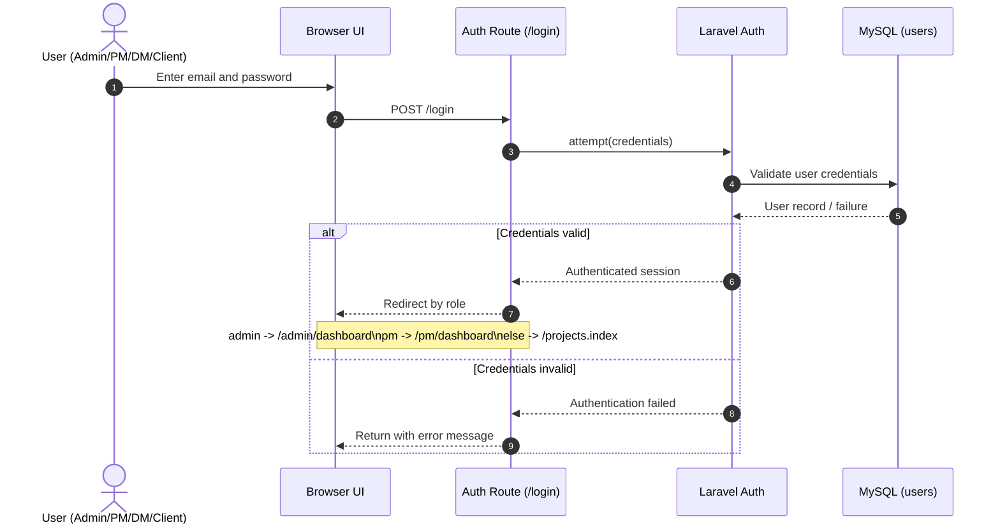
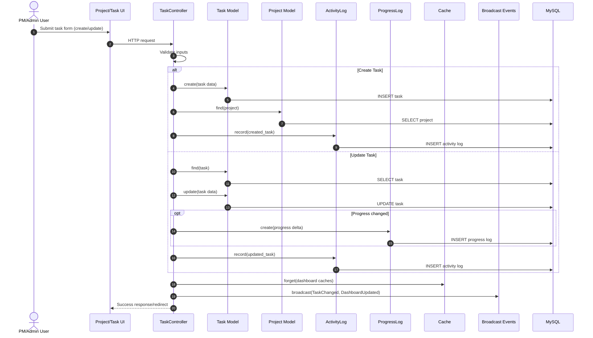

# CapstoneV3 UML Sequence Diagram

This document provides sequence diagrams for the core workflows of CapstoneV3.

## 1. User Login and Role-Based Redirect



## 2. Create/Update Task with Logging and Broadcast



## 3. Post Task Comment, Notify Team, and Realtime Update

```mermaid
sequenceDiagram
    autonumber
    actor Actor as Authenticated User
    participant UI as Task Card / Comment UI
    participant CommentController as TaskCommentController
    participant CommentModel as TaskComment Model
    participant TaskModel as Task Model
    participant UserModel as User Model
    participant Mail as Mailer (SMTP)
    participant ActivityLog as ActivityLog
    participant Cache as Cache
    participant Events as Broadcast Events
    participant DB as MySQL

    Actor->>UI: Enter comment/reply and submit
    UI->>CommentController: POST /tasks/{task}/comments
    CommentController->>CommentController: Validate message/link/parent
    CommentController->>TaskModel: resolve task + parent comment
    TaskModel->>DB: SELECT task/comment context
    CommentController->>CommentModel: create(comment)
    CommentModel->>DB: INSERT task_comments

    CommentController->>Events: broadcast(TaskCommentCreated)
    CommentController->>Cache: forget(dashboard caches)
    CommentController->>Events: broadcast(DashboardUpdated)

    CommentController->>UserModel: Collect recipients (team + admins)
    UserModel->>DB: SELECT recipient users
    loop For each recipient
        CommentController->>Mail: send(TaskCommentMail)
        Mail-->>CommentController: sent/failed (non-fatal)
    end

    CommentController->>ActivityLog: record(posted_comment)
    ActivityLog->>DB: INSERT activity log
    CommentController-->>UI: Return JSON or redirect back
```

## Notes

- Role-based access is enforced before users reach protected routes.
- Logging (`ActivityLog`, `ProgressLog`) and cache invalidation are part of the normal flow.
- Broadcast failures are handled safely; the main transaction still completes.
